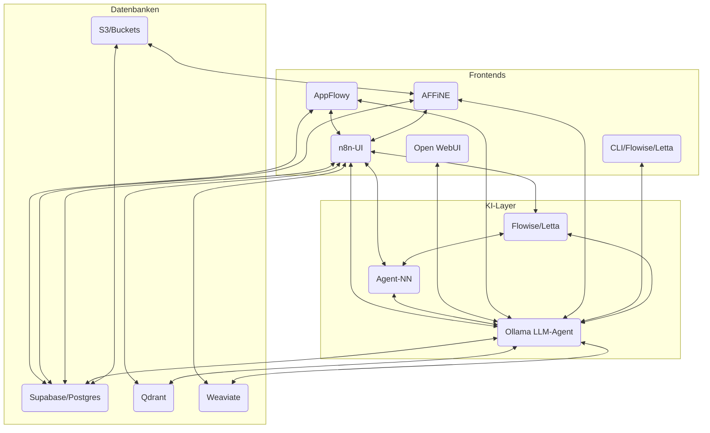

# \ud83c\udf10 Architektur- und Integrationskonzept: KI-basierter Knowledge Hub mit AppFlowy & AFFiNE

## 1. Projekt\u00fcberblick und Zielsetzung

Ziel ist ein selbstgehostetes, zentralisiertes und KI-gest\u00fctztes Wissensmanagement-System, bei dem **AppFlowy** (Notiz- & Projektmanagement) und **AFFiNE** (Dokumente, Whiteboards, Datenbanken) als bidirektional vernetzte Knowledge Hubs dienen.
Alle Datenfl\u00fcsse laufen durch eine einheitliche Integrations- und Automatisierungsschicht (**n8n**), und ein lokaler **LLM-Agent** (Local_RAG_AI_Agent_n8n_Workflow.json) verschmilzt das Wissen aus allen Komponenten zu einem in Echtzeit abfragbaren Kontext.

---

## 2. Kernkomponenten & Architektur

### 2.1. Datenbanken & Wissensspeicher

* **Supabase:** Zentrale PostgreSQL-Datenbank (mit Auth, Storage & pgvector). H\u00e4lt strukturierte Projektdaten, Aufgaben, Notizen etc.
* **Qdrant / Weaviate:** Spezialisierte Vektor-Datenbanken f\u00fcr Embeddings/\u00c4hnlichkeitssuche (semantische Suche, RAG, KI-Queries).
* **AppFlowy & AFFiNE:** Beide nutzen PostgreSQL (direkt oder via Supabase) als Backend. Dokumente, Boards, Wikis, Whiteboards etc. liegen als Datens\u00e4tze in diesen Datenbanken.
* **Dateien/Blobs:** Gr\u00f6\u00dfere Dateien werden ggf. in S3-kompatiblen Buckets abgelegt (\u00fcber Supabase oder AFFiNE File Storage).

### 2.2. Integrationsschicht: n8n

* Orchestriert s\u00e4mtliche Datenfl\u00fcsse zwischen allen Systemen (ETL, bidirektionale Synchronisation).
* Verarbeitet Webhooks, API-Aufrufe und Datenbank\u00e4nderungen, um neue Inhalte automatisch zwischen AppFlowy, AFFiNE, Supabase, Qdrant, Weaviate & weiteren Tools zu synchronisieren.
* Generiert bei neuen oder ge\u00e4nderten Inhalten Embeddings (via Ollama + LLM) und speichert diese in der Vektor-Datenbank.

### 2.3. KI-Layer: LLM-Agent & Agent-NN

* Lokaler, containerisierter LLM-Agent (z.B. Local_RAG_AI_Agent_n8n_Workflow.json).
* **Retrieval-Augmented Generation (RAG):** Holt sich Kontext via Embedding-\u00c4hnlichkeitssuche (Qdrant, Weaviate, Supabase/pgvector).
* Beantwortet semantische Anfragen aus allen Frontends/Workflows (AppFlowy-AI, AFFiNE-AI, Open WebUI, n8n, CLI).
* **Flowise/Letta** (optional): Erlaubt Bau/Orchestrierung von Multi-Agenten-Workflows mit Memory und Tool-Anbindung.
* **Agent-NN** (optional): Modulares Multi-Agenten-System mit Dispatcher und spezialisierten Worker-Diensten.

---

## 3. Funktionsweise & Workflow

### 3.1. Bidirektionale Datenintegration

* Jeder Service (AppFlowy, AFFiNE, GitHub, weitere) kann Daten \u00fcber n8n-Workflows in die Supabase- und/oder Qdrant/Weaviate-DB einbringen.
* Neue Inhalte in AppFlowy/AFFiNE (z.B. Notiz, Whiteboard, Aufgabe) triggern automatisiert einen n8n-Workflow:

  * **Embedding-Erzeugung** via Ollama/LLM
  * Speicherung des Embeddings in Qdrant/Weaviate
  * Bei Bedarf: Spiegelung des Inhalts in andere Systeme (z.B. ein AFFiNE-Task wird ein Issue in GitLab)
* \u00c4nderungen in anderen Systemen (z.B. GitHub, externes Ticketing) werden ebenfalls per n8n in AppFlowy/AFFiNE synchronisiert.
* **Datenmodell:** Wo sinnvoll, einheitliche Namespaces/IDs zur korrekten Zuordnung von Objekten in beiden Knowledge Hubs und den Vektor-DBs.

### 3.2. KI-gest\u00fctzte Suche & Interaktion

* **AI-Chat in AppFlowy & AFFiNE:** Standardm\u00e4\u00dfig werden alle AI-Chat-Interfaces auf den zentralen LLM-Agenten gemappt.

  * Anfrage \u2192 Embedding-Suche \u2192 relevante Dokumente \u2192 LLM-Output \u2192 Antwort ins Frontend.
* **Weitere Interfaces:** Open WebUI (ChatGPT-Style), n8n-Agent-UI, CLI (\u00fcber Letta/Flowise-API) \u2013 alle greifen zentral auf denselben Wissensstand zu.
* **KI-Orchestrierung:** Flowise/Letta erm\u00f6glichen komplexere Skills, Ged\u00e4chtnis, Tool-Nutzung und Workflows f\u00fcr den Agenten.

---

## 4. Zugriff, Rollen & Sicherheit

* **Rollenmanagement:** AppFlowy und AFFiNE bringen eigene Rechte-/Rollenmodelle (Owner, Member, Guest, Team-Admins etc.), die \u00fcber n8n mit anderen Tools abgeglichen werden (z.B. Mapping in Supabase).
* **Auth-Schicht:** Supabase als zentrale Auth-Instanz m\u00f6glich; alternativ Nutzung nativer AppFlowy/AFFiNE-Auth, synchronisiert via n8n.
* **Datenkonsistenz:** n8n stellt sicher, dass alle Daten\u00e4nderungen nur entsprechend der Berechtigungen und m\u00f6glichst atomar synchronisiert werden.
* **API-Zugriffsschutz:** Jeder externe Zugriff auf Datenbanken, Embeddings und den LLM-Agenten wird authentifiziert und ggf. auditiert.

---

## 5. Monitoring & Erweiterbarkeit

* **Monitoring:** Langfuse, Prometheus, Grafana o.\u00e4. \u00fcberwachen Agenten-Performance, Systemgesundheit, Embedding-Updates und Nutzungsmetriken.
* **Skalierung:** Alle Komponenten sind containerisiert (Docker-Compose, Kubernetes-ready) und auf Wachstum ausgelegt.
* **Erweiterung:** Neue Tools/Quellen k\u00f6nnen jederzeit via n8n integriert werden; neue KI-Modelle lassen sich \u00fcber Ollama einfach deployen.

---

## 6. Visualisierte Architektur

---

## 7. Takeaways

* **AppFlowy und AFFiNE** sind die benutzerzentrierten Knowledge Hubs (verschiedene Rollen/Workflows, aber gemeinsamer Wissensspeicher).
* **Supabase, Qdrant, Weaviate** halten strukturierte Daten und Embeddings, f\u00fcr schnelle Suche und KI-RAG.
* **n8n** steuert alle Datenfl\u00fcsse, Synchronisationen und Trigger.
* **LLM-Agent (Ollama)** liefert Antworten und ist über diverse Frontends oder Automatisierungstools nutzbar.
* **Agent-NN** erweitert den KI-Layer um ein verteiltes Multi-Agenten-System für komplexe Aufgaben.
* **Sicherheit & Monitoring** sind von Beginn an integriert.

---

### Praxis: Beispiel-Workflow

1. **User** legt neue Wiki-Seite in AppFlowy an \u2192
2. **n8n** erkennt \u00c4nderung, erzeugt Embedding, schreibt in Qdrant/Supabase, synchronisiert mit AFFiNE
3. **KI-Chat** (egal ob AppFlowy, AFFiNE, WebUI): User fragt nach relevantem Wissen \u2192
4. **LLM-Agent** sucht kontextuelle Embeddings, generiert Antwort, gibt aus
5. **Rollen/Zugriffsregeln** werden immer gepr\u00fcft (nur lesbare Daten f\u00fcr User)

---

**Mit dieser Architektur entsteht eine leistungsf\u00e4hige, erweiterbare Self-Hosted Knowledge-Platform, die alle Datenquellen und -senken miteinander verbindet, automatisiert Embeddings erzeugt, und in Echtzeit einen zentralen Wissensagenten bereitstellt.**

