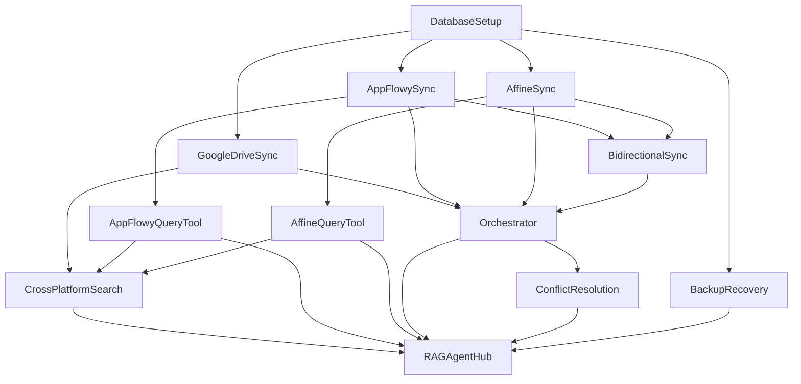

# 🚀 Knowledge Management Workflow Deployment Guide

## Übersicht der erstellten Workflows

Basierend auf der Architektur und dem bestehenden `Local_RAG_AI_Agent_n8n_Workflow.json` wurden folgende Workflows erstellt:

### 1. **AppFlowy Content Sync to Vector Store** (`AppFlowyContentSync`)
**Zweck:** Automatische Synchronisation von AppFlowy-Inhalten in die Vektor-Datenbank
- **Trigger:** AppFlowy Row Created/Updated
- **Funktionen:** Content-Extraktion, Embedding-Generierung, Qdrant-Speicherung
- **Integration:** Direkte AppFlowy API-Anbindung
- **Webhook:** Keine (Trigger-basiert)

### 2. **Affine Content Sync to Vector Store** (`AffineContentSync`)
**Zweck:** Automatische Synchronisation von Affine-Inhalten in die Vektor-Datenbank
- **Trigger:** Polling + Webhook für Echtzeit-Updates
- **Funktionen:** GraphQL-Abfragen, Content-Transformation, Vector-Speicherung
- **Integration:** Affine GraphQL API
- **Webhook:** `/webhook/affine-content-webhook`

### 3. **Enhanced RAG AI Agent with Knowledge Management** (`EnhancedRAGAgent`)
**Zweck:** Erweiterte Version des ursprünglichen RAG-Agents mit KM-Tools
- **Trigger:** Chat Trigger + Webhook
- **Funktionen:** Multi-Tool AI Agent mit erweiterten Capabilities
- **Integration:** Alle anderen Workflows als Tools
- **Webhook:** `/webhook/enhanced-rag-agent`

### 4. **Bidirectional Knowledge Sync** (`BidirectionalKnowledgeSync`)
**Zweck:** Bidirektionale Synchronisation zwischen AppFlowy und Affine
- **Trigger:** Webhook-basiert
- **Funktionen:** Content-Transformation, Mapping-Management, Conflict-Detection
- **Integration:** AppFlowy + Affine APIs
- **Webhook:** `/webhook/trigger-knowledge-sync`

### 5. **Central Knowledge Management Orchestrator** (`KnowledgeOrchestrator`)
**Zweck:** Master-Controller für das gesamte Knowledge Management System
- **Trigger:** Cron (minutenweise) + Webhook
- **Funktionen:** Health-Monitoring, Sync-Koordination, AI-Analysis
- **Integration:** Koordiniert alle anderen Workflows
- **Webhook:** `/webhook/knowledge-orchestrator`

### 6. **AppFlowy Direct Query Tool** (`AppFlowyQueryTool`)
**Zweck:** Direkte Abfrage-Schnittstelle für AppFlowy
- **Trigger:** Webhook für Tool-Aufrufe
- **Funktionen:** Semantic + Direct Search, Result-Ranking
- **Integration:** AppFlowy API + Qdrant
- **Webhook:** `/webhook/appflowy-query-tool`

### 7. **Affine Direct Query Tool** (`AffineQueryTool`)
**Zweck:** Direkte Abfrage-Schnittstelle für Affine
- **Trigger:** Webhook für Tool-Aufrufe
- **Funktionen:** GraphQL + Semantic Search, Block-Level-Search
- **Integration:** Affine GraphQL + Qdrant
- **Webhook:** `/webhook/affine-query-tool`

### 8. **Cross-Platform Knowledge Search Tool** (`CrossPlatformSearch`)
**Zweck:** Plattformübergreifende intelligente Suche
- **Trigger:** Webhook für Tool-Aufrufe
- **Funktionen:** Multi-Platform-Aggregation, Deduplication, Priority-Ranking
- **Integration:** Alle Query-Tools + Google Drive
- **Webhook:** `/webhook/cross-platform-search`

### 9. **Knowledge Management Database Setup** (`DatabaseSetup`)
**Zweck:** Initialisierung der Datenbankstruktur
- **Trigger:** Webhook für Setup-Operationen
- **Funktionen:** Schema-Erstellung, Extensions, Views, Triggers
- **Integration:** PostgreSQL-Datenbank
- **Webhook:** `/webhook/setup-knowledge-database`

### 10. **Enhanced Google Drive Knowledge Sync** (`GoogleDriveKnowledgeSync`)
**Zweck:** Erweiterte Google Drive Integration (erweitert den ursprünglichen Workflow)
- **Trigger:** File Created/Updated + Webhook
- **Funktionen:** Multi-Format-Support, Cross-Platform-Sync
- **Integration:** Google Drive API + Vector Store
- **Webhook:** `/webhook/google-drive-webhook-sync`

### 11. **Knowledge Management Conflict Resolution** (`ConflictResolution`)
**Zweck:** Automatische Konflikterkennung und -lösung
- **Trigger:** Cron (5-minütig) + Webhook
- **Funktionen:** Conflict-Detection, AI-Resolution, Status-Updates
- **Integration:** PostgreSQL Analytics + AI Agent
- **Webhook:** `/webhook/resolve-knowledge-conflicts`

### 12. **Automated Knowledge Management Backup & Recovery** (`BackupRecovery`)
**Zweck:** Umfassendes Backup- und Recovery-System
- **Trigger:** Scheduled (täglich/wöchentlich) + Webhook
- **Funktionen:** Multi-System-Backups, Validation, Recovery
- **Integration:** PostgreSQL, Qdrant, AppFlowy, Google Drive
- **Webhooks:** `/webhook/backup-knowledge-management`, `/webhook/restore-knowledge-management`

### 13. **RAG Agent Integration Hub** (`RAGAgentIntegrationHub`) ⭐
**Zweck:** Hauptintegration - erweitert den ursprünglichen Local RAG AI Agent
- **Trigger:** Chat + Webhook + Google Drive Integration
- **Funktionen:** Alle Tools integriert, intelligente Query-Analyse, Session-Management
- **Integration:** Ersetzt/erweitert `Local_RAG_AI_Agent_n8n_Workflow.json`
- **Webhooks:** `/webhook/rag-agent-hub`, `/webhook/google-drive-integration`

## 📋 Deployment-Reihenfolge

### Phase 1: Infrastruktur (Erforderlich)
1. **DatabaseSetup** - Datenbankschema erstellen
2. **Enhanced Google Drive Knowledge Sync** - Erweiterte Drive-Integration

### Phase 2: Content-Synchronisation
3. **AppFlowy Content Sync** - AppFlowy-Integration
4. **Affine Content Sync** - Affine-Integration
5. **Bidirectional Knowledge Sync** - Plattformübergreifende Sync

### Phase 3: Query- und Search-Tools
6. **AppFlowy Direct Query Tool** - AppFlowy-Abfragen
7. **Affine Direct Query Tool** - Affine-Abfragen
8. **Cross-Platform Knowledge Search Tool** - Plattformübergreifende Suche

### Phase 4: System-Management
9. **Knowledge Management Orchestrator** - System-Koordination
10. **Conflict Resolution** - Konfliktlösung
11. **Backup & Recovery** - Datensicherung

### Phase 5: Integration (Hauptkomponente)
12. **RAG Agent Integration Hub** - Hauptintegration ⭐

## 🔗 Workflow-Abhängigkeiten



## ⚙️ Konfiguration der wichtigsten Variablen

Vor dem Deployment müssen folgende n8n-Variablen konfiguriert werden:

### Datenbank-Verbindungen
```env
postgres_password=your_postgres_password
qdrant_api_key=your_qdrant_api_key
```

### API-Tokens
```env
appflowy_api_token=your_appflowy_token
affine_api_token=your_affine_token
ollama_credentials=your_ollama_config
```

### Workspace-IDs
```env
appflowy_workspace_id=your_appflowy_workspace
affine_workspace_id=your_affine_workspace
google_drive_knowledge_folder_id=your_drive_folder
```

### Domain-Konfiguration
```env
domain_name=yourdomain.com
```

## 🚀 Schnellstart-Anleitung

### 1. Voraussetzungen prüfen
- n8n-installer Setup vollständig abgeschlossen
- PostgreSQL mit pgvector-Extension
- Qdrant Vector Database läuft
- AppFlowy und Affine installiert und konfiguriert

### 2. Datenbank initialisieren
```bash
curl -X POST https://n8n.yourdomain.com/webhook/setup-knowledge-database \
  -H "Content-Type: application/json" \
  -d '{"mode": "full", "enableExtensions": true}'
```

### 3. Workflows in Reihenfolge importieren
1. Alle JSON-Workflows in n8n importieren
2. Credentials konfigurieren
3. Variablen setzen
4. Workflows nacheinander aktivieren (siehe Deployment-Reihenfolge)

### 4. RAG Agent Integration Hub aktivieren
- Als letzten Schritt den **RAG Agent Integration Hub** aktivieren
- Dies ersetzt/erweitert den ursprünglichen `Local_RAG_AI_Agent_n8n_Workflow.json`

### 5. System-Test
```bash
# Test der Hauptintegration
curl -X POST https://n8n.yourdomain.com/webhook/rag-agent-hub \
  -H "Content-Type: application/json" \
  -d '{"chatInput": "Tell me about the current system health and available knowledge sources"}'
```

## 🔧 Integration mit bestehendem Local RAG AI Agent

Der **RAG Agent Integration Hub** wurde speziell entwickelt, um den bestehenden `Local_RAG_AI_Agent_n8n_Workflow.json` zu erweitern:

### Kompatibilität
✅ **Behält alle ursprünglichen Features:**
- Google Drive Trigger (File Created/Updated)
- Postgres Chat Memory
- Ollama LLM Integration
- Qdrant Vector Store
- Text Splitting und Embeddings

✅ **Erweitert um neue Capabilities:**
- 7 zusätzliche spezialisierte Tools
- Intelligente Query-Analyse
- Cross-Platform-Search
- System-Management-Tools
- Erweiterte Session-Protokollierung

### Migration
1. **Sanfte Migration:** Der neue Hub kann parallel zum alten Workflow laufen
2. **Webhook-Kompatibilität:** Neue Webhooks überschneiden sich nicht mit bestehenden
3. **Datenkompatibilität:** Nutzt dieselben Datenstrukturen (Qdrant, Postgres)
4. **Tool-Erweiterung:** Alle neuen Tools sind optional und können schrittweise aktiviert werden

## 📊 Monitoring und Analytics

Nach dem Deployment stehen umfangreiche Analytics zur Verfügung:

### Verfügbare Analytics-Views
- `recent_knowledge_activity` - 24h-Aktivitätszusammenfassung
- `platform_health_summary` - Plattform-spezifische Gesundheitsmetriken
- `search_analytics_summary` - Such-Performance-Metriken

### Monitoring-Dashboards
- System-Health über Orchestrator
- Query-Performance über Analytics-Tables
- Backup-Status über Backup-Logs
- Conflict-Resolution-Metriken

## 🎯 Nächste Schritte

1. **Deployment ausführen** gemäß Reihenfolge
2. **System testen** mit verschiedenen Query-Typen
3. **Performance optimieren** basierend auf Analytics
4. **Backup-Strategie** implementieren
5. **Monitoring einrichten** für Production-Environment

---

**Hinweis:** Der RAG Agent Integration Hub ist die Hauptkomponente, die alle anderen Workflows orchestriert und den ursprünglichen Local RAG AI Agent erweitert. Für eine vollständige Knowledge Management-Lösung sollten alle Workflows deployiert werden.
